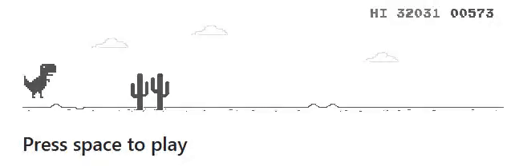

# Dino Chrome Bot




*Bot that plays Chrome's Dinosaur Game*
________________________________________________________

## Table of contents
1. [Overview](README.md#1-overview)  
2. [Quickstart](README.md#3-quickstart)  
    2.1 [Installation](README.md#2.1-installation)  
    2.2 [Run bot](README.md#2.2-run-bot)  
3. [How it works](README.md#3-how-it-works)  


## 1. Overview

The internet connection in my train to Paris was so bad that this was born 🦖😎

## 2. Quickstart

### 2.1 Installation

This program requires `Python >= 3.10`.

For example, using [`conda`](https://docs.anaconda.com/miniconda/install/):

```bash
conda create -y -n dino-chrome-bot python=3.10 --no-default-packages
conda activate dino-chrome-bot
python -m pip install --upgrade pip
```

Then, from the root of the repository:

**Users**

```bash
pip install .
```

**Developers**

```bash
pip install -e .[dev]
pre-commit install
```

## 2.2 Run bot

**Using command**

```bash
conda activate dino-chrome-bot
dino_chrome_bot
```

**Using script**

```bash
conda activate dino-chrome-bot
python dino_chrome_bot/main.py
```

### 3. How it works

1. Detect dinosaur by template matching.  
2. We focus on a small frame in front of the dinosaur:  
2.1. Daytime: Apply pre-defined binary thresholding.  
2.2. Nighttime: Apply Otsu binary thresholding.  
3. Bot presses a key if the number of white/black pixels is below/above a certain threshold.
